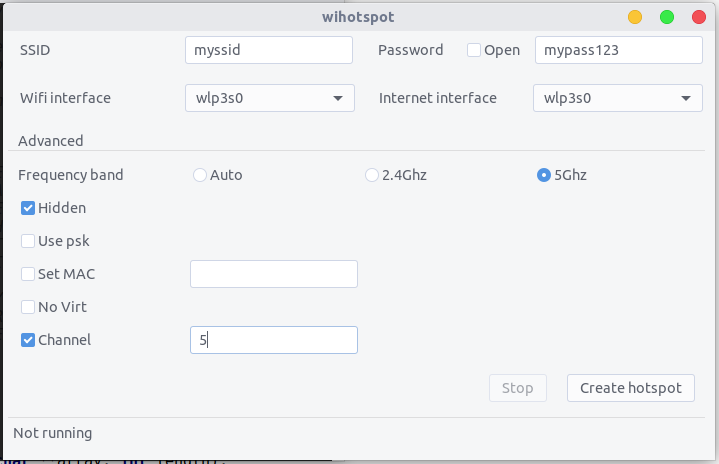

## Linux Wifi Hotspot

### Features
 
* Share your wifi like in Windows - Share wifi on same interface which you are connected to internet.
* Share access point from any network interface
* Includes Both command line and gui.
* Support both 2.4GHz and 5GHz (Need to compatible with your wifi adapter). Ex: You have connected to 5GHz and share connection with 2.4GHz.
* Select Channel to share.
* Hide ssid

[Command line help and documentation](src/scripts/README.md)

### Dependencies

#### General
* bash
* util-linux (for getopt)
* procps or procps-ng
* hostapd
* iproute2
* iw
* iwconfig (you only need this if 'iw' can not recognize your adapter)
* haveged (optional)

_Make sure you have those dependencies by typing them in terminal. If any of dependencies fail
install it using your distro's package manager_

#### For 'NATed' or 'None' Internet sharing method
* dnsmasq
* iptables

#### For building from source

* cmake (https://cmake.org)
* make
* gcc and g++
* build-essential
* pkg-config
* gtk

## Installation
    git clone https://github.com/lakinduakash/linux-wifi-hotspot
    cd linux-wifi-hotspot
    make
    sudo make install
    
    
If you don't want to install it to system, you can run programm from build directory. Then you don't want to run `sudo make install`
    
    
## Uninstallation
    sudo make uninstall
    
## Running
Run in terminal
 `wihotspot`
    
Tested with Ubuntu 18.10. If any issue found, file a issue on github.

**credits** - oblique

## License
FreeBSD

Copyright (c) 2013, oblique

Copyright (c) 2019, lakinduakash
